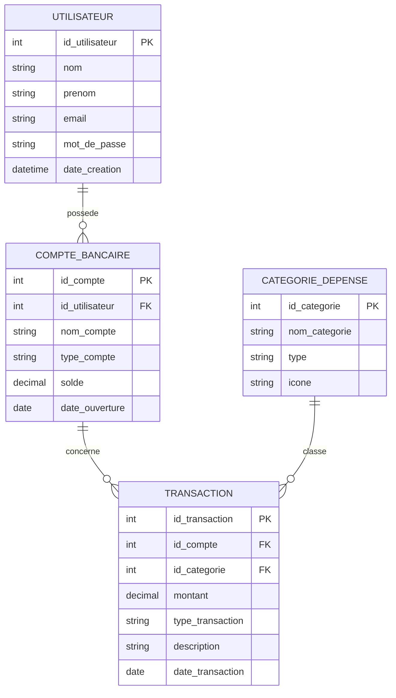

# MCD — Gestion de Finances Personnelles

## Entités et attributs

**UTILISATEUR**
- id_utilisateur (id)
- nom
- prenom
- email
- mot_de_passe
- date_creation

**COMPTE_BANCAIRE**
- id_compte (id)
- nom_compte
- type_compte
- solde
- date_ouverture

**CATEGORIE_DEPENSE**
- id_categorie (id)
- nom_categorie
- type
- icone

**TRANSACTION**
- id_transaction (id)
- montant
- type_transaction
- description
- date_transaction

## Relations et cardinalités

- UTILISATEUR (1,n) —— POSSEDE —— (1,1) COMPTE_BANCAIRE
  → Un utilisateur possède plusieurs comptes bancaires ; un compte appartient à un seul utilisateur.

- COMPTE_BANCAIRE (1,n) —— CONCERNE —— (1,1) TRANSACTION
  → Un compte contient plusieurs transactions ; une transaction appartient à un seul compte.

- CATEGORIE_DEPENSE (1,n) —— CLASSE —— (1,1) TRANSACTION
  → Une catégorie classe plusieurs transactions ; une transaction appartient à une seule catégorie.

## Diagramme (notation Merise simplifiée)

```
UTILISATEUR                    COMPTE_BANCAIRE
┌─────────────────┐            ┌─────────────────┐
│ id_utilisateur PK│            │ id_compte     PK │
│ nom              │  1,n   1,1 │ id_utilisateur FK│
│ prenom           │────POSSEDE────│ nom_compte       │
│ email            │            │ type_compte      │
│ mot_de_passe     │            │ solde            │
│ date_creation    │            │ date_ouverture   │
└─────────────────┘            └────────┬────────┘
                                          │ 1,n
                                       CONCERNE
                                          │ 1,1
                                ┌─────────▼────────┐
CATEGORIE_DEPENSE               │ TRANSACTION       │
┌─────────────────┐            │ id_transaction PK │
│ id_categorie  PK │  1,n   1,1 │ id_compte      FK │
│ nom_categorie    │────CLASSE──│ id_categorie   FK │
│ type             │            │ montant           │
│ icone            │            │ type_transaction  │
└─────────────────┘            │ description       │
                                │ date_transaction  │
                                └───────────────────┘
```

## Diagramme ER (Mermaid — visualisable sur mermaid.live ou dans un artefact)



## Règles de gestion

1. Un utilisateur doit avoir au moins un compte bancaire pour créer une transaction.
2. Le solde d'un compte est mis à jour automatiquement à chaque transaction (crédit = +montant, débit = -montant).
3. Une transaction ne peut exister sans compte ni catégorie associés (clés étrangères obligatoires).
4. La suppression d'un utilisateur entraîne la suppression en cascade de ses comptes (ON DELETE CASCADE), et donc de ses transactions.
5. La suppression d'une catégorie utilisée par des transactions doit être bloquée ou gérée par une catégorie "Autre" par défaut.
